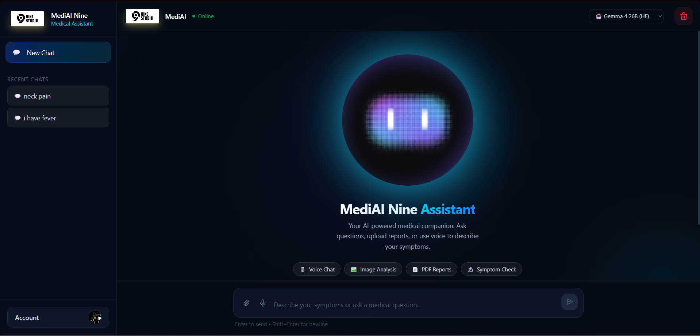
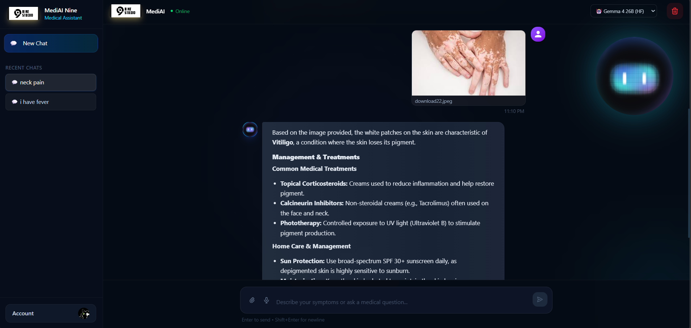

# 🩺 MediAI – AI Medical Assistant

MediAI is an AI-powered medical assistant web application built to help users with **symptom guidance, general health questions, over-the-counter medicine information, and skin issue analysis through uploaded images**.

It provides a clean chatbot interface with AI-generated responses and user-specific chat history.

---

## 🚀 Features

- 💬 AI-powered chatbot for medical guidance
- 🧠 Supports multiple AI models (Gemini / Gemma)
- 🖼️ Upload images for skin issue analysis
- 🔐 User authentication with Clerk
- 🗂️ User-wise chat history storage
- ⚡ Fast and responsive React UI
- 🗄️ SQLite database
- ☁️ Deployment-ready for AWS / Vercel / Render

---

## 🛠️ Tech Stack

### Frontend
- React
- Vite
- JavaScript
- CSS / Tailwind CSS

### Backend
- Node.js
- Express.js

### Database
- SQLite

### AI Models
- Google Gemini
- Gemma (via Hugging Face API)

### Authentication
- Clerk

---

## 📸 Screenshots

### 🖥️ Chat Interface


### 🖼️ Skin Analysis Upload


> Add your screenshots later inside the `screenshots` folder.

---

## ⚙️ Installation

Clone the repository:

```bash
git clone https://github.com/Ankit231ak/Ai-medical-chatbot.git
cd mediAi-app